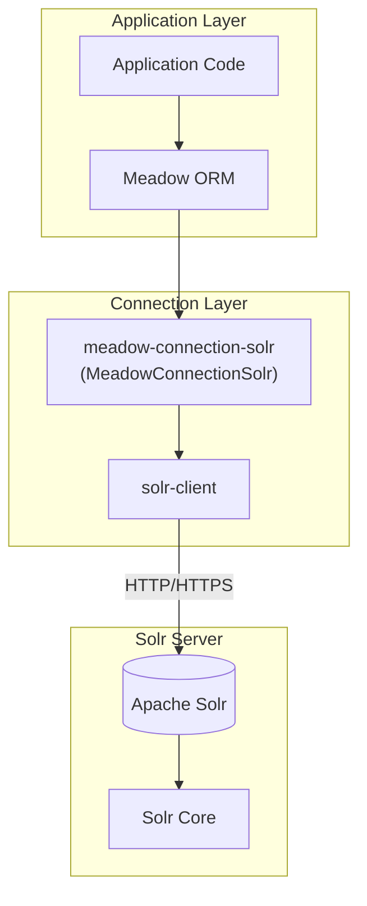
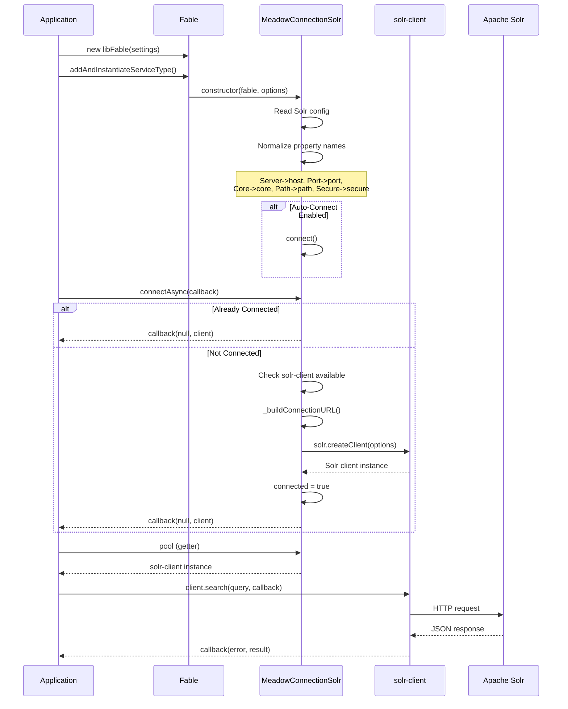
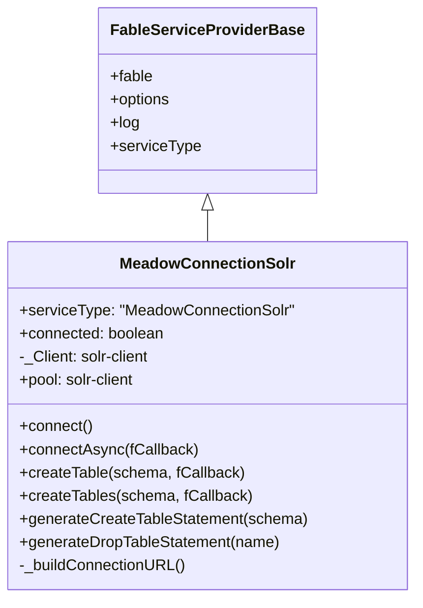
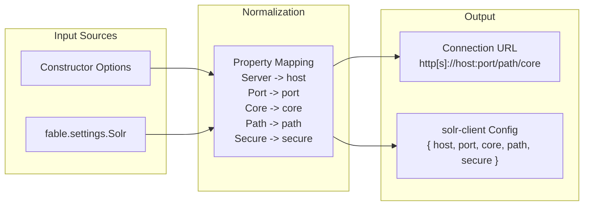
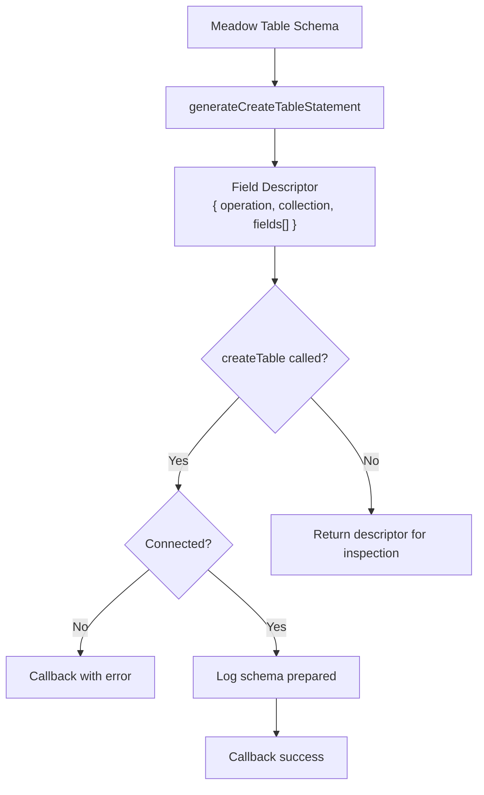
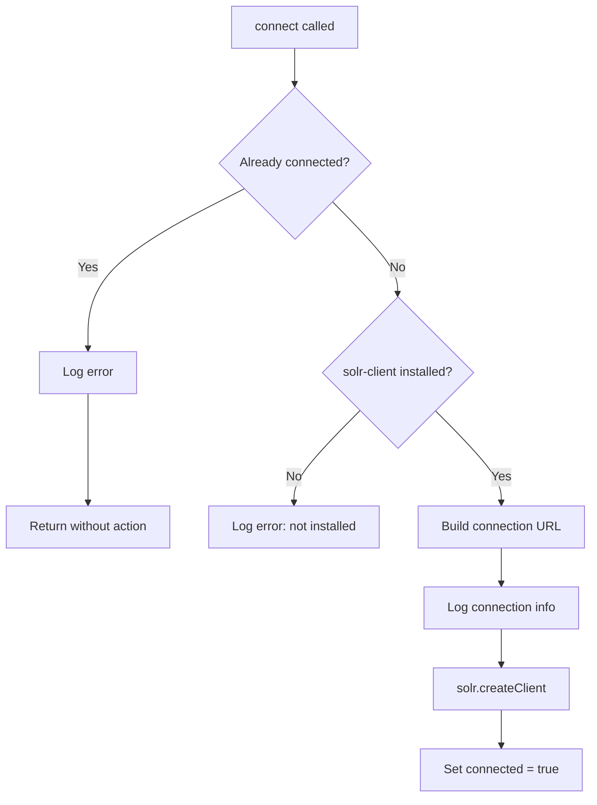

# Architecture

## System Overview

The Solr connector bridges Meadow's data access abstraction with the `solr-client` npm package. Unlike SQL connectors that generate DDL statements, the Solr connector generates schema field descriptors for Solr's Schema API and provides direct access to the Solr client for search, indexing, and document management.

## Connection Lifecycle

## Service Provider Model

`MeadowConnectionSolr` extends `fable-serviceproviderbase`, providing standard lifecycle integration with the Fable ecosystem.

## Settings Flow

## Schema Generation Flow

## Connection Safety

Key safety features:

| Feature | Implementation |
|---------|---------------|
| Double-connect guard | Logs error and returns if `_Client` already exists |
| Missing driver guard | `solr-client` loaded in try/catch; fails gracefully if not installed |
| Missing callback guard | `connectAsync()` provides a no-op callback if none given |
| HTTPS support | `Secure` flag switches protocol from HTTP to HTTPS |

## Connector Comparison

| Feature | Solr | MongoDB | MySQL | PostgreSQL |
|---------|------|---------|-------|-----------|
| Driver | `solr-client` | `mongodb` | `mysql2` | `pg` |
| Protocol | HTTP/HTTPS | TCP | TCP | TCP |
| Connection | HTTP client | MongoClient | Pool | Pool |
| Schema output | Field descriptor | Collection descriptor | SQL DDL | SQL DDL |
| `pool` returns | `solr-client` | `Db` instance | MySQL Pool | `pg.Pool` |
| Primary use case | Full-text search | Document storage | Relational data | Relational data |
| Query language | Solr query syntax | MongoDB query | SQL | SQL |
| Schema model | Fields per core | Collections + indexes | Tables + columns | Tables + columns |
